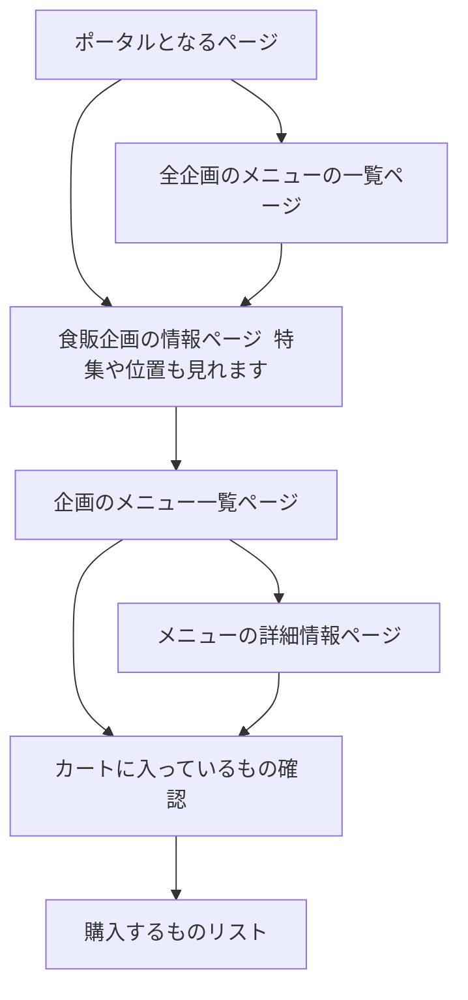

# Awkward-Order(仮の名前)

食事販売ブース(食販)の体験を向上させるサイト。
どんな食販か知る。そして、注文で口ごもらないように。

# ページ遷移



# ページ毎の要件

### トップ(`/`)
- 食販企画の一覧が見れます(6組分)
- 食販エリアへのアクセス(あるいは周辺の地図)が表示されます

### メニュー一覧(`/menu`)
- 企画を横断してメニューが一覧できます
- 特定のアレルギー源を含むものでフィルターを掛ける機能を持たす
- 商品を選択すると、その商品を取り扱っている[[#食販企画データ]]に飛ぶ

### 食販企画ページ(`/<クラス>`)
- 企画の情報
	- 企画名
	- PR文章
	- PR画像(上2つの背景として)
- メニューが見れます
	- 選択はできない
	- 激推しメニュー(企画のおすすめするメニュー1つ)が表示
	- その他の企画のメニューも表示されます
- 混雑率や企画の位置を表す地図も表示します

### 商品選択ページ(`/<クラス>/select`)
- 商品を選択します
	- 商品のカードをタップすると原材料やアレルゲン表示が展開される
- アレルゲンでフィルターをかけられます
- このページより後においては、カートを保持します
	- 企画ページ(あるいはトップ)に戻るとカートの内容は破棄される
- 複数選択、複数個注文可能に
	- 選択時、モーダルによって数量調整可能
	- 選択したものは枠線で囲われる 視覚的に選んだものがわかる

### 選択商品表示ページ(`/order/<メニューのid>`)
- 選択した商品を表示します。下記は載せる情報
	- **商品名**
	- **選択個数×商品の価格 の値**
	- **選択個数**
	- 商品の画像
	- 合計価格
- SNS共有ボタンを設置する
	- Twitter,Instagram,LINE
	- 「◯◯を頼んだよ！」って投稿できるやつです

## その他全体情報
- サイトはライトモードだけにする
- ヘッダーで一つ前に戻れるようにする
- 個人の識別子はステート管理のみに現時点では使われている
	- なので、識別子はリモートのDBには保存しない
	- 特定個人がリピートした、とかの情報は得られない

# API
ログデータや解析、遊びを持たすためのAPIです。サイトで使うことは想定していない(呼び出せないというのもある)

## GET `/api/order/<order_id>`
### query
- `classId`: `classId`でフィルターを掛けます
### return
- [[#注文データ]]の配列を返します 

## GET `/api/program`
### return
- [[#食販企画データ]]の配列を返します

### GET `/api/program/<classId>`
### return
- そのクラスの[[#食販企画データ]]を返します

### GET `/api/program/menu`
### query
- `classId`: `classId`でフィルターを掛けます
- `allergen`: `allergen`でフィルターを掛けます
### return
- [[#メニュー(商品)データ]]の一覧を返します

# 使用技術

- `React Router(v7)`
	- 旧非公式サイトでも使っているもの
	- `framework`mode なので使い方は慣れが必要
- `TypeScript`
	- 型があったりするので負荷はある
	- しかし、時間とか考えたときに型(やそれに付随するシステム群)によって
	  トータルでは時短だと重います 
- `Cloudflare Workers`
	- 配信基盤として、
	- 画像関係の配信APIは引き継ぐ
	- `R2`や`KV`があったりするのでバックエンドで施すこともできる
- `hono`
	- `API`実装する場合はそこから配信できる
	- 書き心地が良い
- `@latimeria/*`
	- ツール群は続行です
	- UIライブラリやデザイントークンは使い回す
- `CSS Modules`
	- 使い回しとか、なんだかんだ細かいところとかやれるので
	- 練度もある
- `biome`
	- デフォルトがそれだったので
- `Github Actions`
	- `Workers`にデプロイ用
	- `CI`回す
- [`vitest`](https://vitest.dev/)
	- [`Workers`](https://developers.cloudflare.com/workers/testing/vitest-integration/)でも動く
	- テストコードを書いて人力動作確認の手間を減らしたい
	- 単体テストや統合テストを中心に

# データ定義

## クラスID
```typescript
type ClassID = `3-${number}`
```
numberも1~6しかないので重複することはない
## 食販企画データ
```typescript
interface Program {
	id: ClassID
	name: string
	class: number
	assets: {
		thumbnail?: string
		header?: string
	} // ファイル名、画像URLなど
	custom: {
		// 環境依存の内容
	}
}
```

## メニュー(商品)データ
```typescript
type ProductID = UUID

interface Product {
	id: ProductID
	classId: ClassID
	name: string
	description?: string // optional
	price: number // 日本円
	assets: {
		thumbnail?: string
	} // ファイル名、画像URLなど
	allergens: string[] // 28品目
}
```

## 注文データ
```typescript
interface OrderData {
	id: UUID // 時間でソート可能な識別ID
	classId: ClassID
    timestamp: timestamp
	purchases: Product[]
}
```
UUIDは時間が生成源の`v7`を使用します。

# 公開に関して
- 食販のwebアプリという側面もあるのでサイトに飛べるQRコードを企画のテントに貼る

