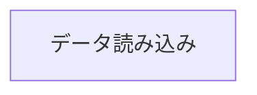

# 商品選択ページ

## アーキテクチャ

## データ読み込み

商品選択ページのURLは`/:classId/select`です。`:classId`はクラスの番号です(1~6いずれかが入る)

読込時に、`react-router`の`loader()`が実行されてデータがロードされます。中身は企画→そのクラスの商品→オーダーのデータの順に読み込まれます
仮にオーダーがされていない場合は、オーダーを作成してからデータを読み込みます。されているかどうかは`Cookie`で保存します。
オーダーされると`Cookie`にオーダーの`ID`が書き込まれます。次回以降はその`Cookie`の値を元にオーダーのデータを読み込みます。

## ページについて
[Vaul](https://vaul.emilkowal.ski/)で下部のメニューを色々やる。ソート順などをURLの`params`に持たすときは[nuqs](https://nuqs.47ng.com/)を使用する

